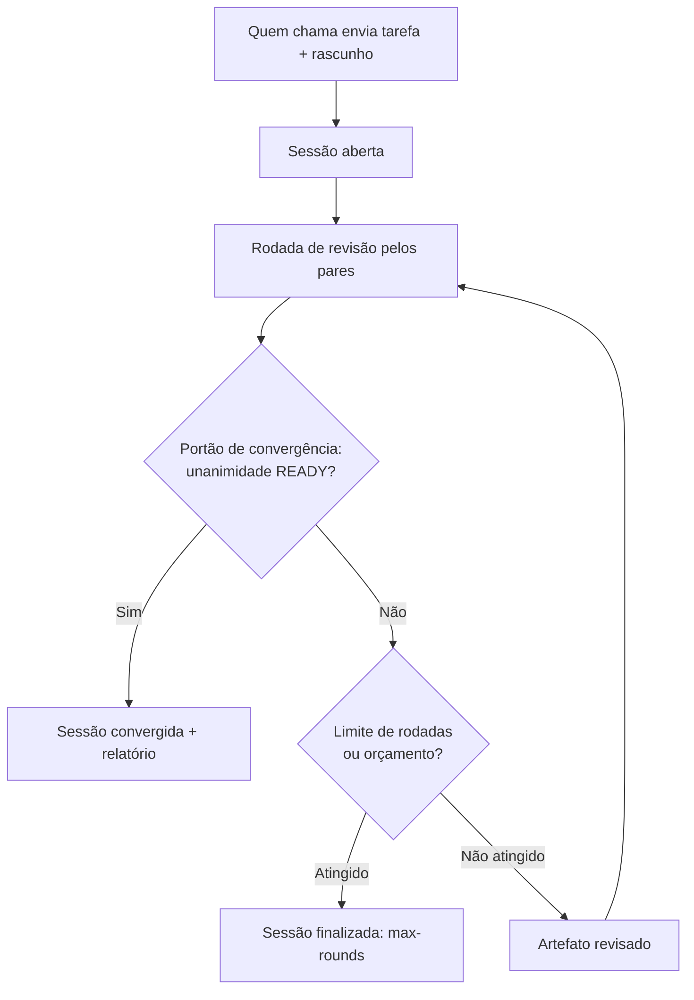

# Cross-Review — Apresentação Técnica

> Documento de apresentação detalhada do `cross-review`: o que é, como
> funciona, características, instalação, configuração, dependências e um
> changelog resumido. As seções 1 a 3 e 8 a 9 são acessíveis a qualquer
> leitor; as seções 4 a 7 aprofundam os aspectos técnicos para profissionais
> de TI e pessoas desenvolvedoras.

---

## Sumário

1. [Visão geral](#1-visão-geral)
2. [Como funciona](#2-como-funciona)
3. [Características](#3-características)
4. [Aspectos técnicos](#4-aspectos-técnicos)
5. [Instalação](#5-instalação)
6. [Configuração](#6-configuração)
7. [Dependências](#7-dependências)
8. [Changelog resumido](#8-changelog-resumido)
9. [Licença e recursos](#9-licença-e-recursos)

---

## 1. Visão geral

### O problema

Um modelo de linguagem (LLM) pode produzir uma resposta **errada com toda a
confiança**. Ele não sinaliza incerteza de forma confiável, não tem um
"segundo par de olhos" e não distingue, sozinho, entre uma afirmação que
verificou e uma que apenas presumiu. Quando esse resultado é usado para
decidir algo — aprovar um trecho de código, validar um documento, dar um
parecer — o erro passa adiante sem ninguém perceber.

### A solução

O `cross-review` resolve isso submetendo um rascunho ao escrutínio de
**vários modelos de IA de fornecedores diferentes**, que se revisam até
chegarem a um **acordo unânime**. Nenhum modelo decide sozinho. Um resultado
só é considerado "pronto" quando **todos** os revisores selecionados
concordam — e quando nenhum deles falhou ou deixou de emitir um veredito
legível por máquina.

A analogia mais próxima é um **colegiado** (um tribunal com vários juízes) ou
a **revisão por pares** da ciência: a decisão não vale pela autoridade de um
único avaliador, mas pela convergência de avaliadores independentes.

### O que é, em termos concretos

`cross-review` é um **servidor MCP** (Model Context Protocol) que orquestra
chamadas às APIs oficiais de seis provedores de IA e expõe esse fluxo de
revisão como um conjunto de ferramentas. Ele é distribuído como o pacote npm
`@lcv-ideas-software/cross-review`, licenciado sob Apache-2.0.

Os seis pares revisores (a "sexteto") são:

| Par revisor  | Provedor   | Acesso                           |
| ------------ | ---------- | -------------------------------- |
| `codex`      | OpenAI     | biblioteca cliente OpenAI        |
| `claude`     | Anthropic  | biblioteca cliente Anthropic     |
| `gemini`     | Google     | biblioteca cliente Google Gen AI |
| `deepseek`   | DeepSeek   | API compatível com OpenAI        |
| `grok`       | xAI        | API compatível com OpenAI        |
| `perplexity` | Perplexity | API Sonar, compatível com OpenAI |

As chamadas são **reais** por padrão — o servidor conversa com as APIs de
verdade. Versões simuladas ("stubs") existem apenas para testes de fumaça e
integração contínua, e só são ativadas com uma combinação explícita de
variáveis de ambiente, justamente para que um stub nunca valide uma decisão
de revisão por engano.

### Para quem é

- **Times e agentes de IA** que querem um portão de qualidade antes de
  "fechar" um artefato (código, documento, parecer, especificação).
- **Pessoas desenvolvedoras** que usam assistentes de IA e desejam reduzir o
  risco de aceitar uma saída plausível, porém incorreta.
- **Quem integra MCP** em seus fluxos e quer uma ferramenta de consenso
  multi-modelo pronta para uso.

---

## 2. Como funciona

### O fluxo, em linguagem simples

1. **Quem chama envia** uma tarefa (`task`) e um rascunho inicial
   (`initial_draft`) — o artefato a ser revisado.
2. **O servidor abre uma sessão** durável e roda **rodadas** de revisão.
3. **A cada rodada**, os pares selecionados leem o artefato e devolvem um
   **veredito legível por máquina**: `READY` (pronto), `NOT_READY` (não
   pronto) ou `NEEDS_EVIDENCE` (falta evidência).
4. **O portão de convergência** verifica se houve **unanimidade**.
5. **Se ainda não convergiu**, o artefato é revisado e uma nova rodada
   começa. Se convergiu — ou se um limite (de rodadas ou de orçamento) for
   atingido —, a sessão é finalizada com um relatório.



### A regra de unanimidade

Uma sessão **converge somente quando**:

- o status de quem chama é `READY`;
- **todos** os pares selecionados devolvem `READY`;
- **nenhum** par falhou nem omitiu um status legível por máquina.

Alguns problemas **sempre bloqueiam** a unanimidade até serem resolvidos —
por exemplo, uma resposta que não pôde ser interpretada mesmo após tentativa
de recuperação (`unparseable_after_recovery`), um prompt barrado pela
moderação do provedor (`prompt_flagged_by_moderation`) ou a detecção de que
um modelo foi silenciosamente rebaixado (`silent_model_downgrade`).

### Qualidade da decisão, par a par

Para cada par, a qualidade do veredito é classificada:

- **`clean`** — status interpretado sem ressalvas;
- **`format_warning`** — interpretado, com avisos não bloqueantes;
- **`recovered`** — recuperado via reparo de formato, nova tentativa segura
  para moderação ou sanitização limitada;
- **`needs_operator_review`** — nenhum status interpretável restou após a
  recuperação;
- **`failed`** — uma falha de provedor ou de seleção de modelo bloqueou o
  par.

### Os três modos de deliberação

O modo é escolhido por quem chama e define o "rito" da revisão:

- **`ship`** (padrão) — o rascunho é o **artefato em refinamento**. Um par
  designado como **relator** (`lead_peer`) produz, a cada rodada, uma **nova
  versão revisada** em prosa, enquanto os demais pares votam em paralelo.
  Indicado para levar um artefato até a versão final.
- **`review`** — o rascunho é o **objeto de avaliação**. O relator pode
  emitir respostas estruturadas; os pares votam em paralelo. Indicado para
  pareceres de aprovar/rejeitar sobre código ou material externo.
- **`circular`** — **custódia deliberativa serial**. Quem chama submete o
  artefato; o **rotador da rodada** ou aprova sem mudanças ou revisa; a
  convergência ocorre quando uma rotação completa termina **sem alteração
  substantiva**. Não há votação paralela. É o modo indicado para produzir
  **artefatos de prosa ou especificações** compartilhadas.

### O sorteio do relator e a regra anti-autorrevisão

Quando quem chama é um dos pares, omitir o `lead_peer` ativa um **sorteio do
relator**: o servidor escolhe aleatoriamente um par **diferente** de quem
chamou para atuar como relator — uma mecânica inspirada nos colegiados
judiciais. Indicar explicitamente um `lead_peer` igual a quem chamou é
**rejeitado** pelo servidor (`caller_cannot_be_lead_peer`): **um agente nunca
revisa a si mesmo**. Essa é uma trava rígida do projeto.

### A pré-checagem de evidência

Antes de qualquer chamada paga, as ferramentas que rodam até a unanimidade
executam uma **pré-checagem puramente textual de evidência**. Ela detecta o
caso de uma submissão que **afirma** ter concluído um trabalho ("os testes
passaram", "o build está verde") mas **não embute nenhuma evidência
concreta** (trechos de diff, saída de comando, hashes, referências de
linha). Nesse caso, a sessão é encerrada localmente com
`needs_evidence_preflight` — **sem gastar orçamento de API**. A pré-checagem
é deliberadamente conservadora: um plano de trabalho legítimo, sem diff,
passa normalmente.

---

## 3. Características

- **Seis pares revisores** de fornecedores independentes, simétricos no
  papel: cada par pode atuar como quem chama, relator ou revisor.
- **Portão de convergência unânime** — a marca central do produto: nada é
  "pronto" sem acordo total.
- **Três modos de deliberação** (`ship`, `review`, `circular`) para
  diferentes tipos de artefato.
- **Sessões duráveis** — cada sessão grava artefatos em JSON e Markdown em
  disco, podendo ser lida, retomada e auditada depois.
- **Trabalhos em segundo plano** — rodadas longas podem rodar de forma
  assíncrona, com acompanhamento por sondagem (`poll`), sem travar o cliente.
- **Fluxo de eventos** — cada sessão grava um stream durável de eventos
  (`events.ndjson`) para acompanhamento de trabalhos longos.
- **Controles financeiros** — chamadas pagas ficam bloqueadas até que tetos
  de orçamento e tabelas de preço sejam configurados; estimativas de custo
  barram uma rodada antes de ela começar.
- **Cache de prompt** entre provedores, com telemetria uniforme e um
  manifesto de cache por sessão.
- **Streaming de tokens** — progresso por contagem de caracteres, sem expor
  texto sensível por padrão.
- **Observabilidade** — um log NDJSON por processo, além de relatórios de
  sessão com convergência, falhas, qualidade da decisão e custos.
- **Painel local** — uma interface HTTP somente-leitura para inspecionar
  sessões, eventos, relatórios, sondagens e métricas.
- **Seleção de modelo sem rebaixamento silencioso** — cada par é fixado em um
  modelo canônico; problemas de disponibilidade aparecem de forma visível em
  vez de se transformarem num modelo mais fraco.

---

## 4. Aspectos técnicos

> Esta seção é voltada a profissionais de TI e pessoas desenvolvedoras.

### 4.1. As dez camadas de runtime

O `cross-review` é uma implementação **API-first**, organizada em camadas:

1. **Servidor MCP** — expõe as ferramentas de fluxo de trabalho via stdio.
2. **Orquestrador** — cria sessões, roda as revisões, verifica a unanimidade
   e pede ao relator que revise o artefato.
3. **Adaptadores de par** — chamam as APIs oficiais e as bibliotecas cliente
   dos provedores.
4. **Seleção de modelo** — consulta as APIs de modelos e valida o modelo
   canônico fixado para cada par.
5. **Armazenamento de sessão** — grava artefatos duráveis em JSON e Markdown
   sob `data/sessions`.
6. **Eventos de sessão** — grava streams `events.ndjson` por sessão para
   trabalhos longos.
7. **Streaming de tokens** — emite eventos `peer.token.delta` e
   `peer.token.completed` baseados em contagem.
8. **Relatórios** — grava `session-report.md` com convergência, falhas,
   qualidade da decisão, custos e eventos recentes.
9. **Observabilidade** — grava um log NDJSON por processo sob `data/logs`.
10. **Painel** — interface HTTP local, somente leitura, para sessões,
    eventos, relatórios, sondagens e métricas.

### 4.2. O protocolo MCP e o transporte

O servidor implementa o **Model Context Protocol** e se comunica com o host
(o cliente MCP) via **stdio**. Ele se registra como dois binários: o servidor
de revisão em si (`cross-review`) e o painel (`cross-review-dashboard`).

Como as rodadas de revisão real são intencionalmente **longas**, o tempo
limite da requisição entre host e servidor deve ser configurado para **pelo
menos 300 segundos**. Para hosts que não conseguem manter uma requisição MCP
aberta por tanto tempo, o servidor oferece ferramentas que criam um
**trabalho em segundo plano** e retornam imediatamente; o progresso é
acompanhado por sondagem.

### 4.3. Os adaptadores de par

Cada par tem um adaptador que normaliza a conversa com seu provedor:

- **OpenAI/Codex** — biblioteca cliente OpenAI, via Responses API.
- **Anthropic/Claude** — biblioteca cliente Anthropic.
- **Google/Gemini** — biblioteca cliente Google Gen AI.
- **DeepSeek** — API compatível com OpenAI, pela biblioteca cliente OpenAI.
- **xAI/Grok** — API compatível com OpenAI, pela biblioteca cliente OpenAI.
- **Perplexity** — API Sonar (`https://api.perplexity.ai`), compatível com o
  formato Chat Completions da OpenAI.

O Perplexity tem particularidades relevantes: por padrão, **toda chamada faz
uma busca web em tempo real**, o que o torna um revisor com perfil de
"verificação de fatos"; quando atua como relator (síntese), a busca é
desativada. Seu preço tem uma dimensão extra: além de tokens de entrada e
saída, há uma taxa por mil requisições que varia com o tamanho do contexto
de busca.

### 4.4. Seleção de modelo: política de não-rebaixamento

Cada par é fixado em **exatamente um** modelo canônico. Na inicialização da
sessão ou da sondagem, o servidor consulta a API de modelos do provedor para
validar a disponibilidade. **Se o modelo fixado não aparecer na resposta, o
servidor mantém o modelo fixado mesmo assim** — nunca troca silenciosamente
por um modelo mais fraco. Assim, qualquer problema de disponibilidade aparece
de forma visível nas sondagens e nas rodadas, em vez de se transformar numa
degradação invisível de qualidade.

Modelos canônicos atuais (cada um substituível por uma variável de ambiente
explícita `CROSS_REVIEW_<PROVEDOR>_MODEL`):

| Par          | Modelo canônico          |
| ------------ | ------------------------ |
| OpenAI/Codex | `gpt-5.5`                |
| Anthropic    | `claude-opus-4-8`        |
| Google       | `gemini-3.1-pro-preview` |
| DeepSeek     | `deepseek-v4-pro`        |
| xAI/Grok     | `grok-4.3`               |
| Perplexity   | `sonar-reasoning-pro`    |

Como o `cross-review` é orientado à correção, os adaptadores pedem
explicitamente o maior nível de raciocínio que cada API oficial oferece. O
conteúdo bruto de "pensamento" (chain-of-thought) **não é solicitado nem
persistido**; a continuidade da sessão é representada por prompts, decisões
estruturadas dos pares, resumos e artefatos.

### 4.5. Modelo de execução real e stubs

O padrão de runtime é **execução real de API**. Os stubs ficam desativados a
não ser que `CROSS_REVIEW_STUB=1` esteja definido **junto** com uma
confirmação explícita (`CROSS_REVIEW_STUB_CONFIRMED=1` ou `NODE_ENV=test`).
Esse pareamento existe por segurança: um stub jamais deve validar, por
descuido, uma decisão de revisão real, e tampouco se deve cobrar de quem
deliberadamente pediu o modo simulado.

### 4.6. Streaming e moderação

Dois controles regem o streaming: `CROSS_REVIEW_STREAM_EVENTS` (eventos de
fluxo) e `CROSS_REVIEW_STREAM_TOKENS` (progresso de tokens), ambos ativos por
padrão. Por segurança, os eventos `peer.token.delta` carregam **contagens de
caracteres**, não o texto do provedor. Incluir o texto (redigido) é uma
opção explícita (`CROSS_REVIEW_STREAM_TEXT=1`), pensada para diagnósticos
locais confiáveis.

Para reduzir a chance de um prompt ser barrado pela moderação, o histórico
dos pares é resumido a partir de campos estruturados, em vez de reproduzir o
texto bruto do modelo. Se ainda assim um provedor barrar o prompt, o
orquestrador registra a classe da falha e tenta **uma vez** com um prompt
compacto e sanitizado — sem burlar a política do provedor.

### 4.7. Cache de prompt

O runtime integra-se ao cache de prompt de cada provedor compatível, emite um
evento uniforme `provider.cache.usage` e grava um `cache_manifest.json` por
sessão. Os modos de cache observados são: `auto` (OpenAI, DeepSeek, Grok),
`explicit` (Anthropic), `implicit` (Gemini) e `not_supported` (Perplexity,
cuja API Sonar não expõe superfície de cache). O cache pode ser desativado
globalmente com `CROSS_REVIEW_DISABLE_CACHE=true`.

### 4.8. As 28 ferramentas MCP

O servidor expõe 28 ferramentas. Agrupadas por finalidade:

**Descoberta e diagnóstico**

- `server_info` — informações e capacidades do servidor.
- `runtime_capabilities` — capacidades efetivas do runtime.
- `probe_peers` — testa a disponibilidade e a autenticação dos pares.

**Ciclo de vida da sessão**

- `session_init` — abre uma sessão.
- `session_list` — lista sessões (paginada, resumida por padrão).
- `session_read` — lê uma sessão completa.
- `session_finalize` — finaliza uma sessão.
- `session_recover_interrupted` — recupera sessões interrompidas.
- `session_sweep` — faz a varredura/limpeza de sessões.

**Execução da revisão**

- `ask_peers` — consulta os pares.
- `session_start_round` — inicia uma rodada (em segundo plano).
- `run_until_unanimous` — roda rodadas até a unanimidade (bloqueante).
- `session_start_unanimous` — roda até a unanimidade (em segundo plano).
- `session_cancel_job` — solicita o cancelamento cooperativo de um trabalho.

**Acompanhamento**

- `session_poll` — sonda o estado de uma sessão.
- `session_events` — lê o fluxo de eventos.
- `session_metrics` — métricas da sessão.
- `session_doctor` — diagnóstico e modo de reparo opcional.
- `session_report` — gera/lê o relatório da sessão.
- `session_check_convergence` — verifica a convergência.

**Evidência**

- `session_attach_evidence` — anexa evidência à sessão.
- `session_evidence_checklist_update` — atualiza a checklist de evidência.
- `session_evidence_judge_pass` — passada de juiz de evidência.
- `session_evidence_judge_consensus_pass` — passada de juiz por consenso.
- `session_judgment_precision_report` — relatório de precisão de julgamento.

**Governança e escalonamento**

- `contest_verdict` — contesta um veredito.
- `escalate_to_operator` — escala uma decisão ao operador humano.
- `regenerate_caller_tokens` — regenera os tokens de capacidade de quem
  chama.

### 4.9. Armazenamento, eventos e relatórios

Cada sessão é durável: o **armazenamento de sessão** grava `meta.json`,
rascunhos por rodada e demais artefatos sob `data/sessions`. O **fluxo de
eventos** (`events.ndjson`) registra o andamento de forma append-only. Ao
final, o **relatório** (`session-report.md`) consolida convergência, falhas,
qualidade da decisão, custos e os eventos recentes. A **observabilidade**
grava ainda um log NDJSON por processo sob `data/logs`.

---

## 5. Instalação

### Pré-requisitos

- **Node.js 22 ou superior**.
- Chaves de API dos provedores que se pretende usar (veja a seção 6).

### Instalação via npm

```bash
npm install -g @lcv-ideas-software/cross-review
```

Alternativamente, pelo espelho do GitHub Packages:

```bash
npm install -g @lcv-ideas-software/cross-review --registry=https://npm.pkg.github.com
```

A instalação disponibiliza dois binários: `cross-review` (o servidor MCP) e
`cross-review-dashboard` (o painel local).

### Build a partir do código-fonte

```bash
npm install
npm run build
node dist/src/mcp/server.js
```

### Registro no host MCP

O servidor é iniciado pelo host MCP (por exemplo, um assistente compatível
com MCP), que o executa como um processo e se comunica via stdio. Configure o
**tempo limite de requisição do host para pelo menos 300 segundos**, já que
as rodadas de revisão real são longas.

### Testes de fumaça sem custo

```bash
# PowerShell
$env:CROSS_REVIEW_STUB = "1"
$env:CROSS_REVIEW_STUB_CONFIRMED = "1"
npm test
```

Os testes de fumaça usam stubs e **não chamam** as APIs dos provedores.

---

## 6. Configuração

A configuração é feita por **variáveis de ambiente** e por um **arquivo de
configuração central** (`config.json`) no diretório de dados, que elimina a
necessidade de declarar dezenas de variáveis em cada host.

### 6.1. Chaves de API

Cada provedor é autenticado por uma variável de ambiente. Exemplo
(PowerShell):

```powershell
[Environment]::SetEnvironmentVariable("OPENAI_API_KEY", "<chave>", "User")
[Environment]::SetEnvironmentVariable("ANTHROPIC_API_KEY", "<chave>", "User")
[Environment]::SetEnvironmentVariable("GEMINI_API_KEY", "<chave>", "User")
[Environment]::SetEnvironmentVariable("DEEPSEEK_API_KEY", "<chave>", "User")
[Environment]::SetEnvironmentVariable("GROK_API_KEY", "<chave>", "User")
[Environment]::SetEnvironmentVariable("PERPLEXITY_API_KEY", "<chave>", "User")
```

Reinicie o terminal, o editor ou o host MCP após alterar variáveis de
ambiente. **Nunca** coloque chaves reais em arquivos `.env`, prompts, logs,
issues ou capturas de tela.

### 6.2. Controles financeiros (obrigatórios para chamadas pagas)

As chamadas pagas ficam **bloqueadas** até que tetos de orçamento e tabelas
de preço sejam configurados. O projeto, de propósito, **não embute preços**
de provedores, pois eles mudam com frequência. Se a configuração financeira
estiver ausente, a sessão é finalizada como `max-rounds` com o motivo
`financial_controls_missing` — **antes** de qualquer chamada paga.

```powershell
[Environment]::SetEnvironmentVariable("CROSS_REVIEW_MAX_SESSION_COST_USD", "20", "User")
[Environment]::SetEnvironmentVariable("CROSS_REVIEW_PREFLIGHT_MAX_ROUND_COST_USD", "20", "User")
[Environment]::SetEnvironmentVariable("CROSS_REVIEW_UNTIL_STOPPED_MAX_COST_USD", "20", "User")
```

As tabelas de preço são informadas por par, em dólares por milhão de tokens,
nas variáveis `CROSS_REVIEW_<PROVEDOR>_INPUT_USD_PER_MILLION` e
`CROSS_REVIEW_<PROVEDOR>_OUTPUT_USD_PER_MILLION`. O orçamento máximo de saída
é controlado por `CROSS_REVIEW_MAX_OUTPUT_TOKENS` (padrão `20000`).

### 6.3. Seleção de modelo e raciocínio

Use as variáveis de substituição apenas quando quiser fixar um modelo
diferente do canônico:

```powershell
[Environment]::SetEnvironmentVariable("CROSS_REVIEW_OPENAI_MODEL", "gpt-5.5", "User")
[Environment]::SetEnvironmentVariable("CROSS_REVIEW_OPENAI_REASONING_EFFORT", "xhigh", "User")
```

### 6.4. Tempo limite e streaming

- `CROSS_REVIEW_TIMEOUT_MS` — tempo limite HTTP do lado do provedor; padrão
  de 30 minutos.
- `CROSS_REVIEW_STREAM_EVENTS` e `CROSS_REVIEW_STREAM_TOKENS` — controlam o
  streaming; ambos ativos por padrão.
- `CROSS_REVIEW_DISABLE_CACHE=true` — desativa o cache de prompt globalmente.

---

## 7. Dependências

### Ambiente de execução

- **Node.js ≥ 22**, com módulos ECMAScript (`"type": "module"`).
- Escrito em **TypeScript**.

### Dependências de runtime

| Pacote                      | Função                                                     |
| --------------------------- | ---------------------------------------------------------- |
| `@modelcontextprotocol/sdk` | implementação do protocolo MCP                             |
| `@anthropic-ai/sdk`         | cliente da API Anthropic (Claude)                          |
| `@google/genai`             | cliente da API Google Gen AI (Gemini)                      |
| `openai`                    | cliente OpenAI — atende Codex, DeepSeek, Grok e Perplexity |
| `zod`                       | validação de esquemas de entrada                           |
| `pino`                      | logs estruturados (NDJSON)                                 |
| `proper-lockfile`           | trava de arquivo para concorrência segura                  |

### Dependências de desenvolvimento

Ferramentas de qualidade e build: `typescript`, `tsx`, `eslint` com
`typescript-eslint`, `@biomejs/biome`, `prettier` e os tipos auxiliares.

---

## 8. Changelog resumido

O histórico completo está em [CHANGELOG.md](../CHANGELOG.md). A exibição
pública de versão segue o padrão `v00.00.00`; as versões do pacote npm seguem
SemVer. Marcos principais:

| Versão           | Marco                                                                                                            |
| ---------------- | ---------------------------------------------------------------------------------------------------------------- |
| `v2.0.0-alpha.0` | Primeiro servidor MCP, exclusivamente via API/SDK.                                                               |
| `v02.01.00`      | Primeira versão estável do `cross-review`.                                                                       |
| `v02.14.00`      | Grok entra no painel de revisão.                                                                                 |
| `v02.21.00`      | Cache de prompt entre provedores.                                                                                |
| `v02.24.00`      | Trava de proveniência de evidência.                                                                              |
| `v02.25.00`      | Terceiro modo de deliberação: `circular`.                                                                        |
| `v03.00.00`      | Perplexity entra como sexto par — o painel passa a sexteto.                                                      |
| `v03.01.00`      | Arquivo de configuração central (`config.json`).                                                                 |
| `v03.05.00`      | Pré-checagem de evidência antes de chamadas pagas.                                                               |
| `v04.00.00`      | Projeto renomeado de `cross-review-v2` para `cross-review`.                                                      |
| `v04.01.00`      | Endurecimento de segurança: concorrência do armazenamento de sessão, superfície de DoS e redação de credenciais. |
| `v04.02.00`      | Listagem de sessões paginada e semântica de cancelamento.                                                        |
| `v04.02.02`      | Refresh de providers, pins e rate cards.                                                                         |
| `v04.02.03`      | Versão atual (pacote npm `4.2.3`), com pin Gemini 3.1 Pro Preview e rate card Gemini atualizado.                 |

> Nota sobre o nome: até a versão 3.7.5, o projeto foi publicado como
> `@lcv-ideas-software/cross-review-v2`. A v4.0.0 é a primeira versão sob o
> nome canônico, mais curto, `@lcv-ideas-software/cross-review`, adotado
> depois que o projeto-companheiro `cross-review-v1` foi descontinuado e
> arquivado. As entradas históricas do changelog mantêm o nome anterior.

---

## 9. Licença e recursos

- **Licença**: Apache-2.0. Consulte `LICENSE`, `NOTICE` e `THIRDPARTY.md`.
- **Site**: <https://cross-review.lcv.dev>
- **npm**: <https://www.npmjs.com/package/@lcv-ideas-software/cross-review>
- **GitHub**: <https://github.com/LCV-Ideas-Software/cross-review>
- **Divulgação de segurança**: consulte `SECURITY.md`.
- **Como contribuir**: consulte `CONTRIBUTING.md`.
- **Código de conduta**: consulte `CODE_OF_CONDUCT.md`.

---

<p align="center"><sub>Copyright © 2026 LCV Ideas &amp; Software — Apache-2.0</sub></p>
