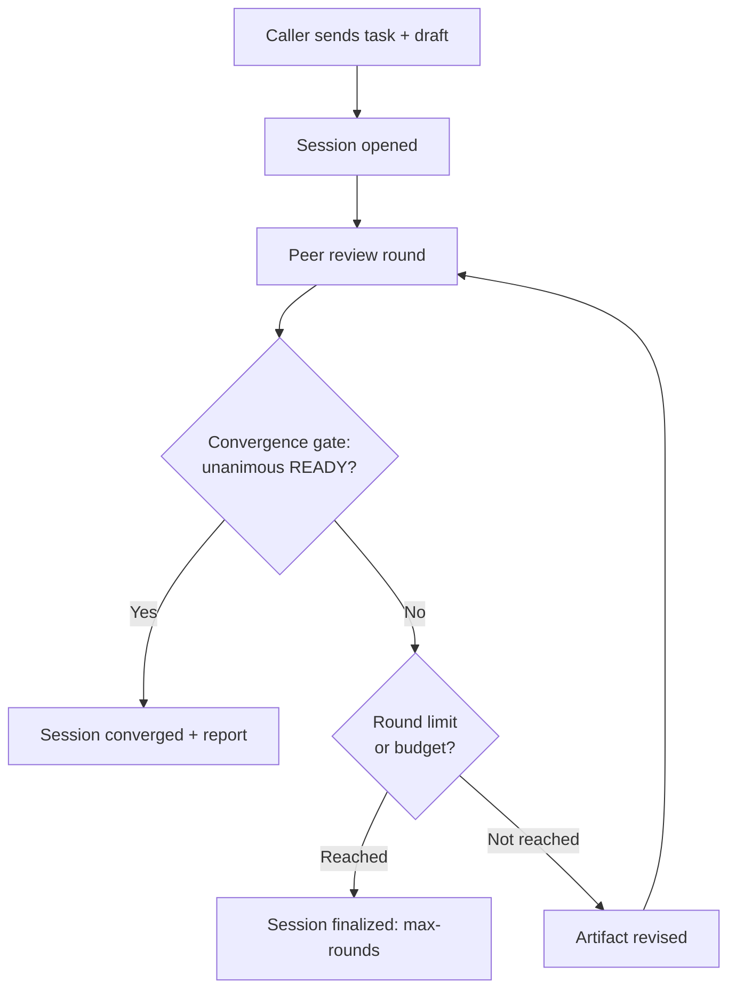

# Cross-Review — Technical Presentation

> Detailed presentation document for `cross-review`: what it is, how it
> works, characteristics, installation, configuration, dependencies and a
> summarized changelog. Sections 1 to 3 and 8 to 9 are accessible to any
> reader; sections 4 to 7 go deeper into the technical aspects for IT
> professionals and developers.
>
> State of the source/release target on 08/09/2026: `7.0.0`. The registry may
> lag behind the source during the workflow; check `npm view
@lcv-ideas-software/cross-review version` for the publication and `server_info`
> for the runtime version actually loaded. Reload the window after a package
> upgrade, a central configuration change or a change of variables.

---

## Contents

1. [Overview](#1-overview)
2. [How it works](#2-how-it-works)
3. [Characteristics](#3-characteristics)
4. [Technical aspects](#4-technical-aspects)
5. [Installation](#5-installation)
6. [Configuration](#6-configuration)
7. [Dependencies](#7-dependencies)
8. [Summarized changelog](#8-summarized-changelog)
9. [License and resources](#9-license-and-resources)

---

## 1. Overview

### The problem

A language model (LLM) can produce an answer that is **wrong with complete
confidence**. It does not signal uncertainty reliably, it has no "second pair
of eyes" and it does not distinguish, on its own, between a statement it has
verified and one it merely assumed. When that result is used to decide
something — approving a piece of code, validating a document, issuing an
opinion — the error passes downstream without anyone noticing.

### The solution

`cross-review` solves this by submitting a draft to the scrutiny of
**several AI models from different vendors**, which review each other until
they reach a **unanimous agreement**. No model decides alone. A result is only
considered "ready" when **all** the selected reviewers agree — and when none of
them failed or omitted a machine-readable verdict.

The closest analogy is a **collegiate panel** (a court with several judges) or
the **peer review** of science: the decision does not hold by the authority of
a single evaluator, but by the convergence of independent evaluators.

### What it is, in concrete terms

`cross-review` is an **MCP server** (Model Context Protocol) that orchestrates
calls to the official APIs of six AI providers and exposes that review flow as
a set of tools. It is distributed as the npm package
`@lcv-ideas-software/cross-review`, licensed under Apache-2.0.

The six reviewing peers (the "sextet") are:

| Reviewing peer | Provider   | Access                                      |
| -------------- | ---------- | ------------------------------------------- |
| `codex`        | OpenAI     | OpenAI client library                       |
| `claude`       | Anthropic  | Anthropic client library                    |
| `gemini`       | Google     | Google Gen AI client library                |
| `deepseek`     | DeepSeek   | OpenAI-compatible API                       |
| `grok`         | xAI        | OpenAI-compatible API                       |
| `perplexity`   | Perplexity | Agent API, compatible with OpenAI Responses |

The calls are **real** by default — the server talks to the actual APIs.
Simulated versions ("stubs") exist only for smoke tests and continuous
integration, and are enabled only by an explicit combination of environment
variables, precisely so that a stub never validates a review decision by
mistake.

### Who it is for

- **AI teams and agents** that want a quality gate before "closing" an artifact
  (code, document, opinion, specification).
- **Developers** who use AI assistants and want to reduce the risk of accepting
  a plausible but incorrect output.
- **Those who integrate MCP** into their flows and want a ready-to-use
  multi-model consensus tool.

---

## 2. How it works

### The flow, in plain language

1. **The caller sends** a task (`task`) and an initial draft
   (`initial_draft`) — the artifact to be reviewed.
2. **The server opens a durable session** and runs review **rounds**.
3. **In each round**, the selected peers read the artifact and return a
   **machine-readable verdict**: `READY`, `NOT_READY` or `NEEDS_EVIDENCE`.
4. **The convergence gate** checks whether there was **unanimity**.
5. **If it has not converged yet**, the artifact is revised and a new round
   begins. If it converged — or if a limit (of rounds or of budget) is
   reached — the session is finalized with a report.



### The unanimity rule

A session **converges only when**:

- the caller's status is `READY`;
- **all** the selected peers return `READY`;
- **no** peer failed or omitted a machine-readable status.

Some problems **always block** unanimity until they are resolved — for
example, a response that could not be parsed even after a recovery attempt
(`unparseable_after_recovery`), a prompt blocked by the provider's moderation
(`prompt_flagged_by_moderation`) or the detection that a model was silently
downgraded (`silent_model_downgrade`).

### Decision quality, peer by peer

For each peer, the quality of the verdict is classified:

- **`clean`** — status parsed with no reservations;
- **`format_warning`** — parsed, with non-blocking warnings;
- **`recovered`** — recovered through format repair, a moderation-safe retry
  or limited sanitization;
- **`needs_operator_review`** — no parseable status remained after recovery;
- **`failed`** — a provider failure or a model-selection failure blocked the
  peer.

### The three deliberation modes

The mode is chosen by the caller and defines the "rite" of the review:

- **`ship`** (default) — the draft is the **artifact under refinement**. A peer
  designated as the **lead peer** (`lead_peer`) produces, in each round, a
  **new revised version** in prose, while the other peers vote in parallel.
  Suited to taking an artifact through to its final version.
- **`review`** — the draft is the **object of evaluation**. The lead peer may
  emit structured responses; the peers vote in parallel. Suited to
  approve/reject opinions on code or external material.
- **`circular`** — **serial deliberative custody**. The caller submits the
  artifact; the **rotator of the round** either approves it unchanged or
  revises it; convergence happens when **every listed rotator** has seen the
  current artifact and left it unchanged — a set of distinct peers, not a run
  of unchanged turns. There is no parallel voting. This is the mode for
  producing shared **prose artifacts or specifications**.

### The lead-peer lottery and the anti-self-review rule

When the caller is one of the peers, omitting `lead_peer` activates a
**lead-peer lottery**: the server randomly picks a peer **different** from the
caller to act as the lead peer — a mechanic inspired by judicial collegiate
panels. Explicitly naming a `lead_peer` equal to the caller is **rejected** by
the server (`caller_cannot_be_lead_peer`): **an agent never reviews itself**.
This is a hard lock of the project.

### The evidence preflight

Before any paid call, the tools that run until unanimity execute a **purely
textual evidence preflight**. It detects the case of a submission that
**claims** to have completed work ("the tests passed", "the build is green")
but **embeds no concrete evidence** (diff excerpts, command output, hashes,
line references). In that case, the unanimous loop preserves the
draft/evidence and finalizes the attempt as `aborted / needs_evidence_preflight`;
a direct round records the local rejection and remains iterable — both **without
spending API budget**.
The same authenticated caller can fix and resend the evidence inline or in the
`evidence` field, with no human operation. The
preflight is deliberately conservative: a legitimate plan, with no diff,
passes normally.

There is also an **operational truthfulness preflight** for claims about
runtime, version, date, session history, workflow, deploy or authorization.
When one of those claims contradicts the loaded runtime or appears with no
matching source, the unanimous loop is preserved and finalized as
`aborted / needs_truthfulness_preflight`; a direct round records the local block
and can take the next correction. The authenticated agent itself can fix the
evidence inline or in the `evidence` field, use the local preflight to check,
and carry on alone.

These controls do not take an agent's word as proof. Every `READY` vote must
cite a source traceable to the artifact or to the transported evidence.
If an operational claim depends only on material sent by a peer, two
independent reviewers must return `READY/verified` and cite path, SHA-256 and
correlated raw lines; `inferred` or narrative repetition does not serve.
Runtime facts only corroborate a matching runtime claim and, on their own, do
not prove review; otherwise, the vote is downgraded to `NEEDS_EVIDENCE`. Claims
about workflow, deploy, hashes, tests and authorization must match values
present in the evidence, and `open` or `not_resurfaced` items prevent
convergence. The author of an ask may withdraw only their own requirement after
strict revalidation (`requester_reverified`); silence does not close it. There
is no promotion of authority: an attachment always carries the provenance of
whoever sent it. Terminal closing is different: the runtime seals `converged`
on its own, and the session's persisted petitioner closes its own non-terminal
session as `aborted` via `session_finalize`. Every new attachment records
author, origin, time, bytes and SHA-256; reading recomputes integrity and fails
closed if there was tampering. Legacy attachments are marked
`legacy_unverified` and stay outside the trusted corpus.

---

## 3. Characteristics

- **Six reviewing peers** from independent vendors, symmetric in their role:
  each peer can act as caller, lead peer or reviewer.
- **Unanimous convergence gate** — the product's central mark: nothing is
  "ready" without full agreement.
- **Three deliberation modes** (`ship`, `review`, `circular`) for
  different kinds of artifact.
- **Durable sessions** — each session writes JSON and Markdown artifacts to
  disk, and can be read, resumed and audited later.
- **Background jobs** — long rounds can run asynchronously, tracked by
  polling (`poll`), without blocking the client.
- **Event stream** — each session writes a durable stream of events
  (`events.ndjson`) for tracking long-running work.
- **Financial controls** — paid calls stay blocked until budget ceilings
  and rate cards are configured; cost estimates stop a round before it starts.
- **Prompt caching** across providers, with uniform telemetry and a per-session
  cache manifest.
- **Token streaming** — progress by character count, without exposing
  sensitive text by default.
- **Observability** — one NDJSON log per process, plus session reports with
  convergence, failures, decision quality and costs.
- **Local dashboard** — a read-only HTTP interface to inspect sessions,
  events, reports, probes and metrics.
- **Model selection with no silent downgrade** — each peer is pinned to a
  canonical model; availability problems show up visibly instead of turning
  into a weaker model.

---

## 4. Technical aspects

> This section is aimed at IT professionals and developers.

### 4.1. The ten runtime layers

`cross-review` is an **API-first** implementation, organized in layers:

1. **MCP server** — exposes the workflow tools over stdio.
2. **Orchestrator** — creates sessions, runs the reviews, checks unanimity
   and asks the lead peer to revise the artifact.
3. **Peer adapters** — call the providers' official APIs and client
   libraries.
4. **Model selection** — queries the model APIs and validates the canonical
   model pinned for each peer.
5. **Session store** — writes durable JSON and Markdown artifacts under
   `<data_dir>/sessions`.
6. **Session events** — writes `events.ndjson` streams per session for
   long-running work.
7. **Token streaming** — emits count-based `peer.token.delta` and
   `peer.token.completed` events.
8. **Reports** — writes `session-report.md` with convergence, failures,
   decision quality, costs and recent events.
9. **Observability** — writes one NDJSON log per process under
   `<data_dir>/logs`.
10. **Dashboard** — local, read-only HTTP interface for sessions, events,
    reports, probes and metrics.

### 4.2. The MCP protocol and the transport

The server implements the **Model Context Protocol** and talks to the host
(the MCP client) over **stdio**. It registers two binaries: the review server
itself (`cross-review`) and the dashboard (`cross-review-dashboard`).

Because real review rounds are intentionally **long-running**, the request
timeout between host and server must be configured to **at least 300 seconds**.
For hosts that cannot keep an MCP request open for that long, the server offers
tools that create a **background job** and return immediately; progress is
tracked by polling.

### 4.3. The peer adapters

Each peer has an adapter that normalizes the conversation with its provider:

- **OpenAI/Codex** — OpenAI client library, via the Responses API.
- **Anthropic/Claude** — Anthropic client library.
- **Google/Gemini** — Google Gen AI client library.
- **DeepSeek** — OpenAI-compatible API, through the OpenAI client library.
- **xAI/Grok** — OpenAI-compatible API, through the OpenAI client library.
- **Perplexity** — Agent API (`https://api.perplexity.ai/v1`), compatible with
  OpenAI's Responses format (alias `/v1/responses`). The Sonar API (Chat
  Completions) is discontinued by Perplexity on 27/09/2026; unprefixed Sonar
  ids are rejected with a migration diagnostic.

Perplexity has relevant particularities: in the reviewer role, the call
declares the `web_search` tool (**real-time web search**), which makes it a
reviewer with a "fact-checking" profile; when it acts as the lead peer
(synthesis), the tool is not sent. Its price has an extra dimension: besides
input, output and cache tokens, there is a fee per search invocation, reported
by the API in `usage.tool_calls_details` and charged per thousand invocations.

Since `v06.00.00`, Perplexity's two long calls (reviewer and lead peer) are
created in **background mode** (`background: true`) and tracked by queries to
`GET /v1/agent/{id}` until the terminal state, because the provider was closing
the synchronous connection at around 300 seconds and dropping the peer from any
long review. Polling remains synchronous. **Consequence for the operator:** it
is only possible to recover a response that the provider stored, so those two
calls now send `store: true` — Perplexity retains the prompt and the response of
those requests instead of discarding them at the end of the call. This applies
only to Perplexity (its polling and the other peers keep `store: false`).
Whoever cannot accept that retention must turn the peer off
(`CROSS_REVIEW_PEER_PERPLEXITY=off`); going back to synchronous mode is not an
alternative, because in that mode the peer does not finish a long review.

### 4.4. Model selection: the no-downgrade policy

Each peer is pinned to **exactly one** canonical model. At session or probe
initialization, the server queries the provider's model API to validate
availability. **If the pinned model does not appear in the response, the server
keeps the pinned model anyway** — it never silently swaps in a weaker model.
That way, any availability problem shows up visibly in probes and rounds,
instead of turning into an invisible quality degradation.

Current canonical models (each one replaceable by an explicit
`CROSS_REVIEW_<PROVIDER>_MODEL` environment variable):

| Peer         | Canonical model          |
| ------------ | ------------------------ |
| OpenAI/Codex | `gpt-6-astra`            |
| Anthropic    | `claude-fable-5-1`       |
| Google       | `gemini-3.1-pro-preview` |
| DeepSeek     | `deepseek-v4-pro`        |
| xAI/Grok     | `grok-4.6`               |
| Perplexity   | `perplexity/kimi-k3`     |

On Fable 5, the adapter omits the explicit `thinking` field, since adaptive
reasoning is automatic, and uses `output_config.effort` for the depth. The
documented retention is 30 days, with no ZDR option. On GPT-5.6 Sol, `ultra` is
a mode of the Codex product, not a literal `reasoning.effort` of the Responses
API; cross-review accepts that alias in the configuration and sends `max` to
the API. Grok 4.6 accepts `low`/`medium`/`high`/`xhigh` and receives `xhigh`
when the alias is used; Perplexity (`perplexity/kimi-k3`) receives `max`.
Explicit overrides for earlier OpenAI families are normalized to the family's
enum: ceiling `xhigh` on GPT-5.5/5.4/5.2 and `high` on GPT-5.1/GPT-5.

Because `cross-review` is correctness-oriented, the adapters explicitly ask
for the highest reasoning level each official API offers. Raw "thinking"
content (chain-of-thought) is **neither requested nor persisted**; session
continuity is represented by prompts, structured peer decisions, summaries and
artifacts.

### 4.5. Real execution model and stubs

The runtime default is **real API execution**. Stubs stay disabled unless
`CROSS_REVIEW_STUB=1` is set **together** with an explicit confirmation
(`CROSS_REVIEW_STUB_CONFIRMED=1` or `NODE_ENV=test`). That pairing exists for
safety: a stub must never carelessly validate a real review decision, and
neither should anyone who deliberately asked for the simulated mode be charged.

### 4.6. Streaming and moderation

Two controls govern streaming: `CROSS_REVIEW_STREAM_EVENTS` (stream events)
and `CROSS_REVIEW_STREAM_TOKENS` (token progress), both on by default. For
safety, `peer.token.delta` events carry **character counts**, not the
provider's text. Including the (redacted) text is an explicit option
(`CROSS_REVIEW_STREAM_TEXT=1`), meant for trusted local diagnostics.

To reduce the chance of a prompt being blocked by moderation, the peers'
history is summarized from structured fields, instead of reproducing the
model's raw text. If a provider still blocks the prompt, the orchestrator
records the failure class and tries **once** with a compact, sanitized prompt —
without circumventing the provider's policy.

### 4.7. Prompt caching

The runtime integrates with each compatible provider's prompt cache, emits a
uniform `provider.cache.usage` event and writes a `cache_manifest.json` per
session. The observed cache modes are: `auto` (OpenAI, DeepSeek, Grok and
Perplexity, whose Agent API reports `cache_read_input_tokens`), `explicit`
(Anthropic) and `implicit` (Gemini).

`CROSS_REVIEW_DISABLE_CACHE=true` globally removes the cache controls the
client can influence. It cannot force Gemini or DeepSeek to disable the
implicit/automatic cache administered by the service.

GPT-5.6 Sol uses `prompt_cache_options` in implicit mode with a 30-minute TTL
and accounts for cache reads and writes separately. Grok 4.6 uses
`prompt_cache_key`, with retention administered by xAI and without inferring
write tokens.

### 4.8. The 30 MCP tools

The server exposes 30 tools. Grouped by purpose:

**Discovery and diagnostics**

- `server_info` — information, capabilities and state of the loaded
  configuration, including hashes, parse error and `reload_required`.
- `runtime_capabilities` — effective runtime capabilities.
- `probe_peers` — tests the availability and authentication of the peers.

**Session lifecycle**

- `session_init` — opens a session.
- `session_list` — lists sessions (paginated, summarized by default).
- `session_read` — reads a complete session.
- `session_finalize` — closes one's own non-terminal session as `aborted`
  (persisted petitioner); `converged` and `max-rounds` are
  written only by the runtime.
- `session_recover_interrupted` — recovers one's own interrupted sessions
  (persisted petitioner). Store-wide recovery happens at trusted startup, not
  through this tool: it rewrites control and health state, rolls back broker
  state and records unknown spend, which no peer may do to another
  petitioner's session.
- `session_sweep` — sweeps/cleans up sessions.

**Review execution**

- `ask_peers` — queries the peers.
- `session_start_round` — starts a round (in the background).
- `run_until_unanimous` — runs rounds until unanimity (blocking).
- `session_start_unanimous` — runs until unanimity (in the background).
- `session_cancel_job` — requests cooperative cancellation; if the job or the
  session has already ended, it answers idempotently with the terminal state.

**Tracking**

- `session_poll` — polls the state with `detail="summary"` limited by
  default; `detail="full"` is the explicit forensic option.
- `session_events` — reads the event stream.
- `session_metrics` — session metrics.
- `session_doctor` — diagnostics for the whole store, plus an optional
  repair mode that rewrites finalized metadata and is therefore scoped like
  every owner mutation: the caller's capability token, and only the caller's
  own sessions. Terminal history
  stays in the totals by default and can be enumerated with
  `include_terminal_findings=true`.
- `session_report` — generates/reads the session report.
- `session_peer_reliability_report` — aggregated, read-only report per
  peer.
- `session_check_convergence` — checks convergence.
- `session_preflight_check` — runs the same evidence and truthfulness gates as
  a real round, without calling providers.
- `session_truthfulness_preflight_check` — legacy alias of the combined preflight.

`session_poll` does not by default retransmit the complete `text`, `raw`
and `structured` bodies of the peers from previous rounds.
`active_round_number` indicates the round in execution and
`latest_completed_round_number` the most recent round already written. Responses
with `response_format="markdown"` are real Markdown, with HTML from external
content neutralized. The compact job status is durable across hosts/restarts;
a late cancellation returns `job_already_terminal` or
`session_already_terminal`, accompanied by `final_state`.

**Evidence**

- `session_attach_evidence` — optional out-of-round attachment channel, open to
  the session's own petitioner and with no promotion whatsoever; agents use
  `evidence`, persisted automatically.
- `session_evidence_judge_pass` — evidence judge pass.
- `session_evidence_judge_consensus_pass` — consensus judge pass.
- `session_judgment_precision_report` — judgment precision report.

**Governance**

- `contest_verdict` — contests a verdict.

### 4.9. Storage, events and reports

Each session is durable: the **session store** writes `meta.json`,
per-round drafts and the remaining artifacts under `<data_dir>/sessions`. The
**event stream** (`events.ndjson`) records progress append-only. At the end,
the **report** (`session-report.md`) consolidates convergence, failures,
decision quality, costs and the recent events. **Observability** also
writes one NDJSON log per process under `<data_dir>/logs`.

---

## 5. Installation

### Prerequisites

- **Node.js 22 or higher**.
- API keys for the providers you intend to use (see section 6).

### Installation via npm

```bash
npm upgrade -g @lcv-ideas-software/cross-review --ignore-scripts --allow-git=none --allow-remote=none
```

Use only the package published by the registry; do not install the runtime
globally from source and do not point the MCP host at this checkout. Afterwards,
reload the MCP window and confirm the effective version in `server_info`.

Alternatively, through the GitHub Packages mirror:

```bash
npm upgrade -g @lcv-ideas-software/cross-review --@lcv-ideas-software:registry=https://npm.pkg.github.com --ignore-scripts --allow-git=none --allow-remote=none
```

The installation makes two binaries available: `cross-review` (the MCP server)
and `cross-review-dashboard` (the local dashboard).

### Runtime policy in development

Builds and validation tests may run in the checkout, but they do not constitute
an installation. The MCP host must run only the published global version.

### Registration in the MCP host

The server is started by the MCP host (for example, an MCP-compatible
assistant), which runs it as a process and communicates over stdio. Configure
the **host request timeout to at least 300 seconds**, since real review rounds
are long-running.

### Smoke tests at no cost

```bash
# PowerShell
$env:CROSS_REVIEW_STUB = "1"
$env:CROSS_REVIEW_STUB_CONFIRMED = "1"
npm test
```

The smoke tests use stubs and do **not call** the providers' APIs.

---

## 6. Configuration

Configuration is done through **environment variables** and a **central
configuration file** (`config.json`) in the data directory, which removes the
need to declare dozens of variables in each host.

### 6.1. API keys

Each provider is authenticated by an environment variable. Example
(PowerShell):

```powershell
[Environment]::SetEnvironmentVariable("OPENAI_API_KEY", "<key>", "User")
[Environment]::SetEnvironmentVariable("ANTHROPIC_API_KEY", "<key>", "User")
[Environment]::SetEnvironmentVariable("GEMINI_API_KEY", "<key>", "User")
[Environment]::SetEnvironmentVariable("DEEPSEEK_API_KEY", "<key>", "User")
[Environment]::SetEnvironmentVariable("GROK_API_KEY", "<key>", "User")
[Environment]::SetEnvironmentVariable("PERPLEXITY_API_KEY", "<key>", "User")
```

Restart the terminal, the editor or the MCP host after changing environment
variables. **Never** put real keys in `.env` files, prompts, logs, issues or
screenshots.

### 6.2. Financial controls (mandatory for paid calls)

Paid calls stay **blocked** until budget ceilings and rate cards
are configured. The project deliberately **does not embed provider prices**,
because they change frequently. If the financial configuration is missing, the
session is finalized as `max-rounds` with the reason
`financial_controls_missing` — **before** any paid call.

```powershell
[Environment]::SetEnvironmentVariable("CROSS_REVIEW_MAX_SESSION_COST_USD", "20", "User")
[Environment]::SetEnvironmentVariable("CROSS_REVIEW_PREFLIGHT_MAX_ROUND_COST_USD", "20", "User")
[Environment]::SetEnvironmentVariable("CROSS_REVIEW_UNTIL_STOPPED_MAX_COST_USD", "20", "User")
```

Rate cards are declared per peer, in dollars per million tokens,
in the `CROSS_REVIEW_<PROVIDER>_INPUT_USD_PER_MILLION` and
`CROSS_REVIEW_<PROVIDER>_OUTPUT_USD_PER_MILLION` variables. The maximum output
budget is controlled by `CROSS_REVIEW_MAX_OUTPUT_TOKENS` (default `20000`).

### 6.3. Model selection and reasoning

Use the override variables only when you want to pin a model different from
the canonical one:

```powershell
[Environment]::SetEnvironmentVariable("CROSS_REVIEW_OPENAI_MODEL", "gpt-6-astra", "User")
[Environment]::SetEnvironmentVariable("CROSS_REVIEW_OPENAI_REASONING_EFFORT", "max", "User")
```

The central file and the variables are loaded once at process start. After
changing them, restart or reload the MCP window/host and confirm in
`server_info.config_load` that `reload_required=false`; there is no live reload.

### 6.4. Timeout and streaming

- `CROSS_REVIEW_TIMEOUT_MS` — provider-side HTTP timeout; default
  of 30 minutes.
- `CROSS_REVIEW_STREAM_EVENTS` and `CROSS_REVIEW_STREAM_TOKENS` — control the
  streaming; both on by default.
- `CROSS_REVIEW_DISABLE_CACHE=true` — globally removes the cache controls
  that the client can influence; it does not turn off caching administered by
  the provider.

---

## 7. Dependencies

### Runtime environment

- **Node.js ≥ 22**, with ECMAScript modules (`"type": "module"`).
- Written in **TypeScript**.

### Runtime and bundle dependencies

| Package                     | Scope         | Purpose                                                     |
| --------------------------- | ------------- | ----------------------------------------------------------- |
| `@modelcontextprotocol/sdk` | `bundled/dev` | MCP implementation embedded in the stdio bundle             |
| `@anthropic-ai/sdk`         | runtime       | Anthropic API client (Claude)                               |
| `@google/genai`             | runtime       | Google Gen AI API client (Gemini)                           |
| `openai`                    | runtime       | OpenAI client — serves Codex, DeepSeek, Grok and Perplexity |
| `zod`                       | runtime       | input schema validation                                     |
| `pino`                      | runtime       | structured logs (NDJSON)                                    |
| `proper-lockfile`           | runtime       | file lock for safe concurrency                              |
| `protobufjs`                | runtime       | protobuf serialization used by the runtime tree             |

`package.json` is the source of truth for the declared ranges, and
`package-lock.json` records the exact resolution of this repository checkout;
consumers resolve the ranges in their own lockfiles.

The MCP SDK is declared in `devDependencies`, but the build embeds it in the
published stdio artifact; it is not a production dependency missing on the consumer side.

### Development dependencies

Quality and build tooling: `typescript`, `tsx`, `eslint` with
`typescript-eslint`, `@biomejs/biome`, `prettier` and the helper types.

---

## 8. Summarized changelog

The complete history is in [CHANGELOG.md](../CHANGELOG.md). The public version
display follows the `v00.00.00` pattern; npm package versions follow
SemVer. Main milestones:

| Version          | Milestone                                                                                                                                                                                                                                                                                                                                                                                                                                                                                                                                                                                                                                                                                                                                                                                                                                                                                                                                                                                                                                                                                                                                                                                                                                                                                                                                                                                                                                                                                                     |
| ---------------- | ------------------------------------------------------------------------------------------------------------------------------------------------------------------------------------------------------------------------------------------------------------------------------------------------------------------------------------------------------------------------------------------------------------------------------------------------------------------------------------------------------------------------------------------------------------------------------------------------------------------------------------------------------------------------------------------------------------------------------------------------------------------------------------------------------------------------------------------------------------------------------------------------------------------------------------------------------------------------------------------------------------------------------------------------------------------------------------------------------------------------------------------------------------------------------------------------------------------------------------------------------------------------------------------------------------------------------------------------------------------------------------------------------------------------------------------------------------------------------------------------------------- |
| `v07.00.00`      | **Major: the operator identity is retired from the protocol.** `caller` is now REQUIRED on every tool that accepts it and `"operator"` is no longer an admissible value, so a host that omitted it and relied on the old default fails schema validation — set it explicitly before upgrading. The nine read-only tools that never accepted `caller` (`session_list`, `session_read`, `session_poll`, `session_metrics`, `session_peer_reliability_report`, `session_events`, `session_report`, `session_check_convergence`, `session_judgment_precision_report`) are unaffected. `escalate_to_operator`, `session_evidence_checklist_update` and `regenerate_caller_tokens` are removed; `session_finalize` accepts only `outcome=aborted` and is petitioner-scoped; `server_info` drops `operator_capability_loaded` and `operator_capability_required`; the `operator_verified` provenance tier is no longer produced, and `host-tokens.json` holds six capabilities instead of seven. The pins move to `gpt-6-astra` and `claude-fable-5-1`, with no second supported model per provider — re-key any `model_cost_rates` card accordingly or the financial preflight blocks. The relator draw now screens the seat's output ceiling against the draft before dispatching a round. Every cross-review-authored surface is English. Also: a Perplexity poll failure no longer re-creates the run it just abandoned — the rethrow carries `safe_to_repeat: false`, read only by the retry loop (issue #298). |
| `v06.00.00`      | Major version: the five legacy keys of the Sonar rate card (`request_fee_low_per_1000`, `request_fee_medium_per_1000`, `request_fee_high_per_1000`, `citation_tokens_per_million`, `deep_research_reasoning_tokens_per_million`) are once again rejected by the strict schema of the central configuration — remove any Sonar card or key from `config.json` before updating, otherwise the whole file is ignored and paid calls stay blocked with `CROSS_REVIEW_CONFIG_FILE_INVALID`. `TokenUsage.citation_tokens`, the three `CostEstimate` line items and the five legacy `CostRateConfig` keys leave the published declarations, so a consumer that references them stops compiling; along with them go `server_info.config_load.deprecated_keys_ignored` and the `citation_tokens` clause of the provider work predicate. Besides that: Perplexity's long calls (reviewer and lead peer) move to background mode (`background: true` plus `GET /v1/agent/{id}`), because the provider was closing the synchronous connection at around 300 s; those two requests now send `store: true`, so Perplexity retains them (issue #296).                                                                                                                                                                                                                                                                                                                                                                        |
| `v05.00.00`      | Major version: `estimateCost` no longer prices the legacy Sonar dimensions; the keys remain accepted by the schema as deprecated and ignored, named at boot; a central config rejected by the schema is now reported at boot.                                                                                                                                                                                                                                                                                                                                                                                                                                                                                                                                                                                                                                                                                                                                                                                                                                                                                                                                                                                                                                                                                                                                                                                                                                                                                 |
| `v04.06.08`      | Evidence custody: a GitHub URL cited in escaped form does not downgrade a READY vote; the lead peer may name a materialized file as the post-image of the admitted diff.                                                                                                                                                                                                                                                                                                                                                                                                                                                                                                                                                                                                                                                                                                                                                                                                                                                                                                                                                                                                                                                                                                                                                                                                                                                                                                                                      |
| `v04.06.07`      | Publication with no manual gesture: the push to `main` that changes the version publishes and the run itself creates the Release last; the ancestry guard is removed.                                                                                                                                                                                                                                                                                                                                                                                                                                                                                                                                                                                                                                                                                                                                                                                                                                                                                                                                                                                                                                                                                                                                                                                                                                                                                                                                         |
| `v04.06.06`      | Publication on GitHub's official model: a published Release triggers the publish, with Trusted Publishing and provenance; the home-grown tag, dispatch and policy machinery is removed.                                                                                                                                                                                                                                                                                                                                                                                                                                                                                                                                                                                                                                                                                                                                                                                                                                                                                                                                                                                                                                                                                                                                                                                                                                                                                                                       |
| `v04.06.05`      | Native organization governance: workflows and Dependabot on the organization standard, CodeQL through the default setup, release pipeline reading the analyses of the exact SHA, legal inventory including the GitHub Actions.                                                                                                                                                                                                                                                                                                                                                                                                                                                                                                                                                                                                                                                                                                                                                                                                                                                                                                                                                                                                                                                                                                                                                                                                                                                                                |
| `v04.06.04`      | Makes conflict correlation linear and exact per `argv`, and parses future/current state through finite frames in English/Portuguese and per-occurrence spans, with `replace … with`, `update … to`, present qualifiers and semicolon isolation.                                                                                                                                                                                                                                                                                                                                                                                                                                                                                                                                                                                                                                                                                                                                                                                                                                                                                                                                                                                                                                                                                                                                                                                                                                                               |
| `v04.06.03`      | Restores the fail-closed behavior against conflicting executions of the same command, the additive constructions `not only`/`não só` and current claims close to planning language, preserving independent RED/GREEN and explicit future targets.                                                                                                                                                                                                                                                                                                                                                                                                                                                                                                                                                                                                                                                                                                                                                                                                                                                                                                                                                                                                                                                                                                                                                                                                                                                             |
| `v04.06.02`      | Republish of v04.06.01 with the pin validator action made self-contained (embedded parser, clean-runner proof), local manifests resolved by reference and the Scorecard allowance restricted by location.                                                                                                                                                                                                                                                                                                                                                                                                                                                                                                                                                                                                                                                                                                                                                                                                                                                                                                                                                                                                                                                                                                                                                                                                                                                                                                     |
| `v04.06.01`      | Republish of v04.06.00 with the supply-chain gate fix: minimal per-job permissions in every workflow, `TokenPermissionsID` back under Scorecard surveillance and real pinning revalidation in the Publish gate covering the immutable same-repo `$/` references.                                                                                                                                                                                                                                                                                                                                                                                                                                                                                                                                                                                                                                                                                                                                                                                                                                                                                                                                                                                                                                                                                                                                                                                                                                              |
| `v04.06.00`      | The Perplexity peer migrates to the Agent API with the `perplexity/kimi-k3` pin ahead of the Sonar sunset (27/09/2026); Grok moves to `grok-4.6` with `xhigh` effort; prices updated from the official docs; deterministic lead-peer lottery smoke with an explicit chi-squared threshold (CROSREV-18, #231).                                                                                                                                                                                                                                                                                                                                                                                                                                                                                                                                                                                                                                                                                                                                                                                                                                                                                                                                                                                                                                                                                                                                                                                                 |
| `v04.05.45`      | The session contract and the peer instruction recognize the persisted evidence channel (200K, SHA-256 custody) as the single unfiltered artifact: asking for a re-paste into the draft body becomes a review defect, unblocking convergence on medium-sized PRs (issue #216).                                                                                                                                                                                                                                                                                                                                                                                                                                                                                                                                                                                                                                                                                                                                                                                                                                                                                                                                                                                                                                                                                                                                                                                                                                 |
| `v04.05.44`      | The scrubber gains a dedicated pattern for the stateless (JWT) format of GitHub App installation tokens (`ghs_` with base64url segments): the whole token is redacted in a single match, without depending on the length of the first segment in the generic JWT pattern (issue #215).                                                                                                                                                                                                                                                                                                                                                                                                                                                                                                                                                                                                                                                                                                                                                                                                                                                                                                                                                                                                                                                                                                                                                                                                                        |
| `v04.05.43`      | The evidence preflight corroborates test counts per record: the RED proof of a TDD (`N failed` with its own run) passes as caller material and a deliberate RED record does not veto green counts from other records; the failure-signal veto still holds within the corresponding record (issue #217).                                                                                                                                                                                                                                                                                                                                                                                                                                                                                                                                                                                                                                                                                                                                                                                                                                                                                                                                                                                                                                                                                                                                                                                                       |
| `v04.05.42`      | Merged legacy spend records preserve the fail-closed state across re-merges (unpriced attempts with no marker count as indeterminate) and the interruption sentinel tolerates a legacy record with no message.                                                                                                                                                                                                                                                                                                                                                                                                                                                                                                                                                                                                                                                                                                                                                                                                                                                                                                                                                                                                                                                                                                                                                                                                                                                                                                |
| `v04.05.41`      | A terminal provider failure with no usage settles as zero cost (unblocking the budget preflight that was killing sessions with an out-of-quota peer); dedicated manual recipe for a hardening failure; the recipes check the descriptor by exclusive handle and compare FullControl by exact equality.                                                                                                                                                                                                                                                                                                                                                                                                                                                                                                                                                                                                                                                                                                                                                                                                                                                                                                                                                                                                                                                                                                                                                                                                        |
| `v04.05.40`      | Resolves whoami/powershell by absolute System32 path (Git Bash's GNU whoami was breaking boot; a writable PATH no longer replaces the DACL engine), raises the boot spawn ceilings (10s→60s; 5s→15s) and classifies the failure stage/cause in the error.                                                                                                                                                                                                                                                                                                                                                                                                                                                                                                                                                                                                                                                                                                                                                                                                                                                                                                                                                                                                                                                                                                                                                                                                                                                     |
| `v04.05.39`      | Prevents a caller token recovery retry within the same boot, recreates only after a confirmed disappearance and makes the manual recipe replace only a protected and empty DACL before validating the exact result.                                                                                                                                                                                                                                                                                                                                                                                                                                                                                                                                                                                                                                                                                                                                                                                                                                                                                                                                                                                                                                                                                                                                                                                                                                                                                           |
| `v04.05.38`      | Locks the T2#10 debt of broad source regexes at the current baseline `smoke=129`, `source-contract=29`, total `158`, preventing new pins from consuming the slack left by the previous ceilings.                                                                                                                                                                                                                                                                                                                                                                                                                                                                                                                                                                                                                                                                                                                                                                                                                                                                                                                                                                                                                                                                                                                                                                                                                                                                                                              |
| `v04.05.37`      | Makes the caller token ACL on Windows tolerant to interruption, recovers a single access denial without rotation or looping and passes path/SID outside the command parser, preserving the fail-closed identity and path gates.                                                                                                                                                                                                                                                                                                                                                                                                                                                                                                                                                                                                                                                                                                                                                                                                                                                                                                                                                                                                                                                                                                                                                                                                                                                                               |
| `v04.05.36`      | Fixes byte-exact JSON citations, preserves active evidence on the decision retry and accepts Perplexity's documented aggregated terminal content without weakening the anti-fabrication gates.                                                                                                                                                                                                                                                                                                                                                                                                                                                                                                                                                                                                                                                                                                                                                                                                                                                                                                                                                                                                                                                                                                                                                                                                                                                                                                                |
| `v04.05.35`      | Protects the public package content, isolates the administrative token in an environment with no Deployment, updates TypeScript ESLint to 8.66.0 and makes the parent-process forensic test deterministic on Windows.                                                                                                                                                                                                                                                                                                                                                                                                                                                                                                                                                                                                                                                                                                                                                                                                                                                                                                                                                                                                                                                                                                                                                                                                                                                                                         |
| `v04.05.34`      | Removes two redundant expressions flagged by GitHub Code Quality, preserving the behavior of the budget preflight and the late attachment fallback when the truthfulness preflight is disabled.                                                                                                                                                                                                                                                                                                                                                                                                                                                                                                                                                                                                                                                                                                                                                                                                                                                                                                                                                                                                                                                                                                                                                                                                                                                                                                               |
| `v04.05.33`      | Replaces the unpublished 4.5.32 tag, recognizes npm's documented `404` only in the negative OIDC probe, preserves the positive gate on `201`, uses escaping identical to npm's and updates the OpenAI resolution to 7.3.0.                                                                                                                                                                                                                                                                                                                                                                                                                                                                                                                                                                                                                                                                                                                                                                                                                                                                                                                                                                                                                                                                                                                                                                                                                                                                                    |
| `v04.05.32`      | Updates the verified npm to 12.0.2, proves the denied and authorized Trusted Publisher contexts before running project code, separates writing from post-publication verification and fixes brace-expansion, fast-uri and ip-address.                                                                                                                                                                                                                                                                                                                                                                                                                                                                                                                                                                                                                                                                                                                                                                                                                                                                                                                                                                                                                                                                                                                                                                                                                                                                         |
| `v04.05.31`      | Replaces the unpublished 4.5.30 tag and makes license validation sensitive to the exact version of the bundled MCP SDK.                                                                                                                                                                                                                                                                                                                                                                                                                                                                                                                                                                                                                                                                                                                                                                                                                                                                                                                                                                                                                                                                                                                                                                                                                                                                                                                                                                                       |
| `v04.05.30`      | Updates OpenAI to 7.0.0 and the bundled MCP SDK to 1.30.0; removes Socket/Step; prevents immutable redispatch; requires an exact GitHub status; and runs Zizmor directly through uv with a checksum.                                                                                                                                                                                                                                                                                                                                                                                                                                                                                                                                                                                                                                                                                                                                                                                                                                                                                                                                                                                                                                                                                                                                                                                                                                                                                                          |
| `v04.05.29`      | Replaces the unpublished 4.5.28 tag, pins `brace-expansion` 5.0.8 after the new DoS advisory blocked the release and preserves the caller token TOCTOU fix validated by CodeQL.                                                                                                                                                                                                                                                                                                                                                                                                                                                                                                                                                                                                                                                                                                                                                                                                                                                                                                                                                                                                                                                                                                                                                                                                                                                                                                                               |
| `v04.05.28`      | Prepares Claude Opus 5 as an explicit override; limits Evidence Broker amplification without weakening blockers; fixes provenance, truthfulness and interrupted lifecycle; protects token ACLs; and paginates events compactly.                                                                                                                                                                                                                                                                                                                                                                                                                                                                                                                                                                                                                                                                                                                                                                                                                                                                                                                                                                                                                                                                                                                                                                                                                                                                               |
| `v04.05.27`      | Updates the Anthropic and OpenAI SDKs, centralizes the versions in the manifests and hardens the dependency and release recovery automations.                                                                                                                                                                                                                                                                                                                                                                                                                                                                                                                                                                                                                                                                                                                                                                                                                                                                                                                                                                                                                                                                                                                                                                                                                                                                                                                                                                 |
| `v04.05.26`      | Bundles the MCP runtime and hardens automation on the exact SHA, immutable releases and current dependencies.                                                                                                                                                                                                                                                                                                                                                                                                                                                                                                                                                                                                                                                                                                                                                                                                                                                                                                                                                                                                                                                                                                                                                                                                                                                                                                                                                                                                 |
| `v04.05.25`      | Fixes `body-parser` 2.3.0, nested `protobufjs` 7.6.5 and `brace-expansion` 5.0.7 in the lock; strictly approves only `protobufjs@7.6.5` for an install script. Scorecard and Auto-tag remain fail-closed without suppressing alerts.                                                                                                                                                                                                                                                                                                                                                                                                                                                                                                                                                                                                                                                                                                                                                                                                                                                                                                                                                                                                                                                                                                                                                                                                                                                                          |
| `v04.05.23`      | Accepts the single response of `npm view --json` on npm 12 only with a metadata object; empty, multiple or invalid fails closed before the intact lock and the mandatory audit.                                                                                                                                                                                                                                                                                                                                                                                                                                                                                                                                                                                                                                                                                                                                                                                                                                                                                                                                                                                                                                                                                                                                                                                                                                                                                                                               |
| `v04.05.22`      | Decodes npm's DSSE envelope and binds the SLSA provenance to the workflow, the protected tag and the commit; the later cryptographic audit remains mandatory.                                                                                                                                                                                                                                                                                                                                                                                                                                                                                                                                                                                                                                                                                                                                                                                                                                                                                                                                                                                                                                                                                                                                                                                                                                                                                                                                                 |
| `v04.05.21`      | Aligns the durable config telemetry fixture with JSON semantics: an optional property that is not configured is omitted from the persisted snapshot and from its canonical SHA-256.                                                                                                                                                                                                                                                                                                                                                                                                                                                                                                                                                                                                                                                                                                                                                                                                                                                                                                                                                                                                                                                                                                                                                                                                                                                                                                                           |
| `v04.05.20`      | Restores a deterministic CI fixture of the budget/cache contract: Gemini receives an explicit rate and a known settlement does not retain an unknown spend marker; the financial gate remains fail-closed.                                                                                                                                                                                                                                                                                                                                                                                                                                                                                                                                                                                                                                                                                                                                                                                                                                                                                                                                                                                                                                                                                                                                                                                                                                                                                                    |
| `v04.05.19`      | Fixes Auto-tag/Scorecard with an intact temporary lock, `npm ci`, the tarball contract and `npm audit signatures`; visibility without a remote pipe.                                                                                                                                                                                                                                                                                                                                                                                                                                                                                                                                                                                                                                                                                                                                                                                                                                                                                                                                                                                                                                                                                                                                                                                                                                                                                                                                                          |
| `v04.05.18`      | Symmetric grounding for factual vetoes, immediate per-peer persistence, auditable terminal preflights, bounded judges, cache/config telemetry and compact actionable reports.                                                                                                                                                                                                                                                                                                                                                                                                                                                                                                                                                                                                                                                                                                                                                                                                                                                                                                                                                                                                                                                                                                                                                                                                                                                                                                                                 |
| `v04.05.17`      | Publishes the accumulated SDK maintenance and preserves the strict npm script block with exact authorization of the no-op lifecycle of Google Gen AI 2.12.0.                                                                                                                                                                                                                                                                                                                                                                                                                                                                                                                                                                                                                                                                                                                                                                                                                                                                                                                                                                                                                                                                                                                                                                                                                                                                                                                                                  |
| `v04.05.16`      | Limits default polling, distinguishes an active round from a completed one, delivers safe real Markdown and makes job state/cancellation durable and explicit across hosts.                                                                                                                                                                                                                                                                                                                                                                                                                                                                                                                                                                                                                                                                                                                                                                                                                                                                                                                                                                                                                                                                                                                                                                                                                                                                                                                                   |
| `v04.05.15`      | Publishes the Evidence Broker continuity with a complete Dependabot hardgate: npm supported in the updater, npm 12 in build/release and an intact pip-compile lock.                                                                                                                                                                                                                                                                                                                                                                                                                                                                                                                                                                                                                                                                                                                                                                                                                                                                                                                                                                                                                                                                                                                                                                                                                                                                                                                                           |
| `v04.05.14`      | Reprocesses locally the strictly grounded historical READY sources without reusing them in the current prompt, collapses safe aliases and persists the reconciled convergence.                                                                                                                                                                                                                                                                                                                                                                                                                                                                                                                                                                                                                                                                                                                                                                                                                                                                                                                                                                                                                                                                                                                                                                                                                                                                                                                                |
| `v04.05.13`      | Removes the ReDoS recurrence from the symbol matcher and prevents tagging/publication until CodeQL for the exact SHA finishes with zero open alerts.                                                                                                                                                                                                                                                                                                                                                                                                                                                                                                                                                                                                                                                                                                                                                                                                                                                                                                                                                                                                                                                                                                                                                                                                                                                                                                                                                          |
| `v04.05.12`      | Fixes Evidence Broker convergence, routes pending IDs automatically and preserves the block on irrelevant or partial evidence.                                                                                                                                                                                                                                                                                                                                                                                                                                                                                                                                                                                                                                                                                                                                                                                                                                                                                                                                                                                                                                                                                                                                                                                                                                                                                                                                                                                |
| `v04.05.11`      | Makes autonomous evidence transport unambiguous: agents use `evidence`, with no human upload, and the operator's optional promotion is not confused with a requirement.                                                                                                                                                                                                                                                                                                                                                                                                                                                                                                                                                                                                                                                                                                                                                                                                                                                                                                                                                                                                                                                                                                                                                                                                                                                                                                                                       |
| `v04.05.10`      | Fixes the race between package visibility and npm attestation propagation with a bounded retry and a fetch pinned to the registry.                                                                                                                                                                                                                                                                                                                                                                                                                                                                                                                                                                                                                                                                                                                                                                                                                                                                                                                                                                                                                                                                                                                                                                                                                                                                                                                                                                            |
| `v04.05.09`      | Separates internal remediation from real peer requests, eliminating the checklist's DEF-10 deadlock without relaxing grounding, custody or the block on unresolved evidence.                                                                                                                                                                                                                                                                                                                                                                                                                                                                                                                                                                                                                                                                                                                                                                                                                                                                                                                                                                                                                                                                                                                                                                                                                                                                                                                                  |
| `v04.05.08`      | Closes seven code scanning alerts with an npm 12.0.1 bootstrap pinned by SHA-512 and a default branch checkout conditioned on the SHA that passed CI.                                                                                                                                                                                                                                                                                                                                                                                                                                                                                                                                                                                                                                                                                                                                                                                                                                                                                                                                                                                                                                                                                                                                                                                                                                                                                                                                                         |
| `v04.05.07`      | Ships the remediation of the six providers with CI before the tag, npm 12.0.1, strict scripts and cache disabled.                                                                                                                                                                                                                                                                                                                                                                                                                                                                                                                                                                                                                                                                                                                                                                                                                                                                                                                                                                                                                                                                                                                                                                                                                                                                                                                                                                                             |
| `v04.05.06`      | Per-provider wire contracts, per-peer budgets, controlled OpenAI/Gemini recovery, diff/escape grounding, runtime namespace, terminals and FinOps fixed.                                                                                                                                                                                                                                                                                                                                                                                                                                                                                                                                                                                                                                                                                                                                                                                                                                                                                                                                                                                                                                                                                                                                                                                                                                                                                                                                                       |
| `v04.05.05`      | Publication follow-up: hermetic cancellation, health and accounting fixtures on a clean runner, with proof against a false green; production remains fail-closed with no rates.                                                                                                                                                                                                                                                                                                                                                                                                                                                                                                                                                                                                                                                                                                                                                                                                                                                                                                                                                                                                                                                                                                                                                                                                                                                                                                                               |
| `v04.05.04`      | Fixes grounding, preflights, consensus, multi-window cancellation, accounting and effective ceilings; exposes the decision chain and accepts `ultra` as an alias normalized per provider.                                                                                                                                                                                                                                                                                                                                                                                                                                                                                                                                                                                                                                                                                                                                                                                                                                                                                                                                                                                                                                                                                                                                                                                                                                                                                                                     |
| `v04.05.03`      | Fixes ReDoS and false hardgate blocks on authenticated citations, correlated single quotes and artifact version bumps.                                                                                                                                                                                                                                                                                                                                                                                                                                                                                                                                                                                                                                                                                                                                                                                                                                                                                                                                                                                                                                                                                                                                                                                                                                                                                                                                                                                        |
| `v04.05.02`      | Publication of automatic evidence transport with a hermetic regression fixture, independent of the operator's central configuration.                                                                                                                                                                                                                                                                                                                                                                                                                                                                                                                                                                                                                                                                                                                                                                                                                                                                                                                                                                                                                                                                                                                                                                                                                                                                                                                                                                          |
| `v04.05.01`      | Automatic authenticated evidence transport, authority with no owner confusion, strictly independent dashboard and immutable terminals.                                                                                                                                                                                                                                                                                                                                                                                                                                                                                                                                                                                                                                                                                                                                                                                                                                                                                                                                                                                                                                                                                                                                                                                                                                                                                                                                                                        |
| `v04.05.00`      | Refresh of the six providers and hardening of terminals, config fingerprint, custody, grounding and anti-fabrication.                                                                                                                                                                                                                                                                                                                                                                                                                                                                                                                                                                                                                                                                                                                                                                                                                                                                                                                                                                                                                                                                                                                                                                                                                                                                                                                                                                                         |
| `v04.04.08`      | Corrected transitive floor for `hono` and the current advisory set closed.                                                                                                                                                                                                                                                                                                                                                                                                                                                                                                                                                                                                                                                                                                                                                                                                                                                                                                                                                                                                                                                                                                                                                                                                                                                                                                                                                                                                                                    |
| `v04.04.07`      | Corrected floor for `protobufjs` for downstream consumers.                                                                                                                                                                                                                                                                                                                                                                                                                                                                                                                                                                                                                                                                                                                                                                                                                                                                                                                                                                                                                                                                                                                                                                                                                                                                                                                                                                                                                                                    |
| `v2.0.0-alpha.0` | First MCP server, exclusively through API/SDK.                                                                                                                                                                                                                                                                                                                                                                                                                                                                                                                                                                                                                                                                                                                                                                                                                                                                                                                                                                                                                                                                                                                                                                                                                                                                                                                                                                                                                                                                |
| `v02.01.00`      | First stable version of `cross-review`.                                                                                                                                                                                                                                                                                                                                                                                                                                                                                                                                                                                                                                                                                                                                                                                                                                                                                                                                                                                                                                                                                                                                                                                                                                                                                                                                                                                                                                                                       |
| `v02.14.00`      | Grok joins the review panel.                                                                                                                                                                                                                                                                                                                                                                                                                                                                                                                                                                                                                                                                                                                                                                                                                                                                                                                                                                                                                                                                                                                                                                                                                                                                                                                                                                                                                                                                                  |
| `v02.21.00`      | Prompt caching across providers.                                                                                                                                                                                                                                                                                                                                                                                                                                                                                                                                                                                                                                                                                                                                                                                                                                                                                                                                                                                                                                                                                                                                                                                                                                                                                                                                                                                                                                                                              |
| `v02.24.00`      | Evidence provenance lock.                                                                                                                                                                                                                                                                                                                                                                                                                                                                                                                                                                                                                                                                                                                                                                                                                                                                                                                                                                                                                                                                                                                                                                                                                                                                                                                                                                                                                                                                                     |
| `v02.25.00`      | Third deliberation mode: `circular`.                                                                                                                                                                                                                                                                                                                                                                                                                                                                                                                                                                                                                                                                                                                                                                                                                                                                                                                                                                                                                                                                                                                                                                                                                                                                                                                                                                                                                                                                          |
| `v03.00.00`      | Perplexity joins as the sixth peer — the panel becomes a sextet.                                                                                                                                                                                                                                                                                                                                                                                                                                                                                                                                                                                                                                                                                                                                                                                                                                                                                                                                                                                                                                                                                                                                                                                                                                                                                                                                                                                                                                              |
| `v03.01.00`      | Central configuration file (`config.json`).                                                                                                                                                                                                                                                                                                                                                                                                                                                                                                                                                                                                                                                                                                                                                                                                                                                                                                                                                                                                                                                                                                                                                                                                                                                                                                                                                                                                                                                                   |
| `v03.05.00`      | Evidence preflight before paid calls.                                                                                                                                                                                                                                                                                                                                                                                                                                                                                                                                                                                                                                                                                                                                                                                                                                                                                                                                                                                                                                                                                                                                                                                                                                                                                                                                                                                                                                                                         |
| `v04.00.00`      | Project renamed from `cross-review-v2` to `cross-review`.                                                                                                                                                                                                                                                                                                                                                                                                                                                                                                                                                                                                                                                                                                                                                                                                                                                                                                                                                                                                                                                                                                                                                                                                                                                                                                                                                                                                                                                     |
| `v04.01.00`      | Security hardening: session store concurrency, DoS surface and credential redaction.                                                                                                                                                                                                                                                                                                                                                                                                                                                                                                                                                                                                                                                                                                                                                                                                                                                                                                                                                                                                                                                                                                                                                                                                                                                                                                                                                                                                                          |
| `v04.02.00`      | Paginated session listing and cancellation semantics.                                                                                                                                                                                                                                                                                                                                                                                                                                                                                                                                                                                                                                                                                                                                                                                                                                                                                                                                                                                                                                                                                                                                                                                                                                                                                                                                                                                                                                                         |
| `v04.02.02`      | Refresh of providers, pins and rate cards.                                                                                                                                                                                                                                                                                                                                                                                                                                                                                                                                                                                                                                                                                                                                                                                                                                                                                                                                                                                                                                                                                                                                                                                                                                                                                                                                                                                                                                                                    |
| `v04.02.03`      | Gemini 3.1 Pro Preview pin and updated Gemini rate card.                                                                                                                                                                                                                                                                                                                                                                                                                                                                                                                                                                                                                                                                                                                                                                                                                                                                                                                                                                                                                                                                                                                                                                                                                                                                                                                                                                                                                                                      |
| `v04.02.04`      | More auditable truthfulness preflight and local retest tool.                                                                                                                                                                                                                                                                                                                                                                                                                                                                                                                                                                                                                                                                                                                                                                                                                                                                                                                                                                                                                                                                                                                                                                                                                                                                                                                                                                                                                                                  |
| `v04.02.05`      | Session auditing, cost split and lead peer provenance hardened.                                                                                                                                                                                                                                                                                                                                                                                                                                                                                                                                                                                                                                                                                                                                                                                                                                                                                                                                                                                                                                                                                                                                                                                                                                                                                                                                                                                                                                               |
| `v04.03.00`      | Pending evidence disposition, offline eval and per-peer report.                                                                                                                                                                                                                                                                                                                                                                                                                                                                                                                                                                                                                                                                                                                                                                                                                                                                                                                                                                                                                                                                                                                                                                                                                                                                                                                                                                                                                                               |
| `v04.03.01`      | Stricter classification of skips caused by provider errors.                                                                                                                                                                                                                                                                                                                                                                                                                                                                                                                                                                                                                                                                                                                                                                                                                                                                                                                                                                                                                                                                                                                                                                                                                                                                                                                                                                                                                                                   |
| `v04.03.02`      | Persistence redaction, finalized session guards and identity gates.                                                                                                                                                                                                                                                                                                                                                                                                                                                                                                                                                                                                                                                                                                                                                                                                                                                                                                                                                                                                                                                                                                                                                                                                                                                                                                                                                                                                                                           |
| `v04.03.03`      | Forensic diagnostics, flush on signals, 5xx retry and current official SDKs.                                                                                                                                                                                                                                                                                                                                                                                                                                                                                                                                                                                                                                                                                                                                                                                                                                                                                                                                                                                                                                                                                                                                                                                                                                                                                                                                                                                                                                  |
| `v04.03.04`      | Cross-process event sequencing, anti-fabrication detector, Gemini fallback and streaming retry hardened.                                                                                                                                                                                                                                                                                                                                                                                                                                                                                                                                                                                                                                                                                                                                                                                                                                                                                                                                                                                                                                                                                                                                                                                                                                                                                                                                                                                                      |
| `v04.03.05`      | `<think>` filter on Perplexity streaming events, `~` config path and hardened smokes/dashboard.                                                                                                                                                                                                                                                                                                                                                                                                                                                                                                                                                                                                                                                                                                                                                                                                                                                                                                                                                                                                                                                                                                                                                                                                                                                                                                                                                                                                               |
| `v04.03.06`      | Isolates `runtime-smoke` in a temporary data dir so it does not contaminate the real session corpus.                                                                                                                                                                                                                                                                                                                                                                                                                                                                                                                                                                                                                                                                                                                                                                                                                                                                                                                                                                                                                                                                                                                                                                                                                                                                                                                                                                                                          |
| `v04.03.07`      | The evidence preflight blocks references to external proof/log artifacts not attached to the session.                                                                                                                                                                                                                                                                                                                                                                                                                                                                                                                                                                                                                                                                                                                                                                                                                                                                                                                                                                                                                                                                                                                                                                                                                                                                                                                                                                                                         |
| `v04.03.08`      | Focused smoke for the behavioral matrix of `evidence_preflight`.                                                                                                                                                                                                                                                                                                                                                                                                                                                                                                                                                                                                                                                                                                                                                                                                                                                                                                                                                                                                                                                                                                                                                                                                                                                                                                                                                                                                                                              |
| `v04.03.09`      | Focused smoke for `truthfulness_preflight` and stricter evidence matching.                                                                                                                                                                                                                                                                                                                                                                                                                                                                                                                                                                                                                                                                                                                                                                                                                                                                                                                                                                                                                                                                                                                                                                                                                                                                                                                                                                                                                                    |
| `v04.04.06`      | Closes the remaining tail of the Claude revalidation: evidence reads in the orchestrator fail closed, `session_doctor` separates terminal history from findings and T2#10 drops to 160 pins.                                                                                                                                                                                                                                                                                                                                                                                                                                                                                                                                                                                                                                                                                                                                                                                                                                                                                                                                                                                                                                                                                                                                                                                                                                                                                                                  |
| `v04.04.05`      | Closes the 7 verified residuals of the audit: fail-closed realpath on evidence, typing of `shadow_decision`, date derived from the CHANGELOG, JWT comment and blocked T2#10 budget.                                                                                                                                                                                                                                                                                                                                                                                                                                                                                                                                                                                                                                                                                                                                                                                                                                                                                                                                                                                                                                                                                                                                                                                                                                                                                                                           |
| `v04.04.04`      | Per-model rate cards in `config.json`, with automatic selection between Claude Opus 4.8 and Claude Fable 5 prices according to the configured model.                                                                                                                                                                                                                                                                                                                                                                                                                                                                                                                                                                                                                                                                                                                                                                                                                                                                                                                                                                                                                                                                                                                                                                                                                                                                                                                                                          |
| `v04.04.03`      | Reduces the T2#10 debt by moving the static SDK lazy imports contract to the dedicated source contracts smoke.                                                                                                                                                                                                                                                                                                                                                                                                                                                                                                                                                                                                                                                                                                                                                                                                                                                                                                                                                                                                                                                                                                                                                                                                                                                                                                                                                                                                |
| `v04.04.02`      | Operational support for Claude Fable 5 as an explicit Anthropic option, with verified selection, refusal handling and cost/retention docs.                                                                                                                                                                                                                                                                                                                                                                                                                                                                                                                                                                                                                                                                                                                                                                                                                                                                                                                                                                                                                                                                                                                                                                                                                                                                                                                                                                    |
| `v04.04.01`      | Complete residual sweep: identity gate on every mutable surface, cache/attachments, async EventLog, auth-only Perplexity probe, cost/cache and a dedicated smoke for source contracts.                                                                                                                                                                                                                                                                                                                                                                                                                                                                                                                                                                                                                                                                                                                                                                                                                                                                                                                                                                                                                                                                                                                                                                                                                                                                                                                        |
| `v04.04.00`      | Consolidated audit release: `log_level`, containment realpath, initial anti-fabrication guard, identity audit, Perplexity probe and docs.                                                                                                                                                                                                                                                                                                                                                                                                                                                                                                                                                                                                                                                                                                                                                                                                                                                                                                                                                                                                                                                                                                                                                                                                                                                                                                                                                                     |

> Note on the name: up to version 3.7.5, the project was published as
> `@lcv-ideas-software/cross-review-v2`. v4.0.0 is the first version under the
> shorter canonical name `@lcv-ideas-software/cross-review`, adopted
> after the companion project `cross-review-v1` was discontinued and
> archived. The historical changelog entries keep the previous name.

---

## 9. License and resources

- **License**: Apache-2.0. See `LICENSE`, `NOTICE` and `THIRDPARTY.md`.
- **Site**: <https://cross-review.lcv.dev>
- **npm**: <https://www.npmjs.com/package/@lcv-ideas-software/cross-review>
- **GitHub**: <https://github.com/LCV-Ideas-Software/cross-review>
- **Security disclosure**: see `SECURITY.md`.
- **How to contribute**: see `CONTRIBUTING.md`.
- **Code of conduct**: see `CODE_OF_CONDUCT.md`.

---

<p align="center"><sub>Copyright © 2026 LCV Ideas &amp; Software — Apache-2.0</sub></p>
